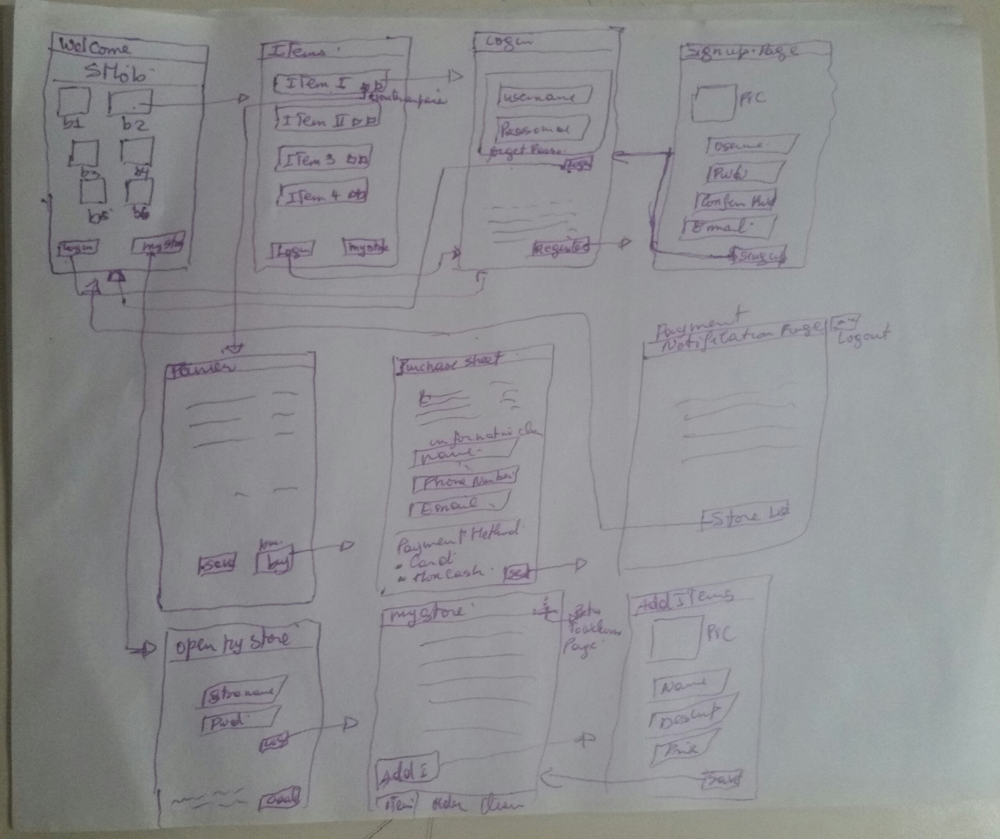

# SMob

## Table of Contents
1. [Overview](#Overview)
1. [Product Spec](#Product-Spec)
1. [Wireframes](#Wireframes)

## Overview
### Description
Allow user to create store, view list of stores existed, sale and buy stuffs.

### App Evaluation
- **Category:** Business
- **Mobile:** This app would be primarily developed for mobile but would perhaps be just as viable on a computer, such as tinder or other similar apps. Functionality wouldn't be limited to mobile devices, however mobile version could potentially have more features.
- **Story:** present products online for promotion with the ability to sell and buy more easily
- **Market:** Any individual could choose to use this app. 
All traders in the formal and / or informal sector can present their products, which will be available to any category of people on the market
- **Habit:** This app could be used as often or unoften as the user wanted depending on his needs, and what exactly they're looking for.
- **Scope:** First user can zap into the list of shops and see their contents, then login or create a shop.

## Product Spec
### 1. User Stories (Required and Optional)

**Required Must-have Stories**

* User can view a list of store, view Items in a chosen store.
* User can sign up. 
* User can sign in.
* User can add items in basket and save or buy.
* Vendor can create Store.
* Vendor can add items, manage orders and clients.

**Optional Nice-to-have Stories**

 * User can pull down to refresh store timeline and items timeline
 * After login seller can view list of commande and list of client offline
 * User will be using the app Communicate directly with the seller
 * User can choose to receive notification of new items add
 * Seller User can add a Store Logo and description
 * Seller User will have marketing option
 * Create client community
 * share marketing review and video
 * User can view all the marketing video and reviews

### 2. Screen Archetypes

* Login 
* Register - User signs up or logs into their account
   * ...
* Basket
   * Upon selecting items choice users can save chart for later action or buy items at once.
* List store screen 
   * Allows user to view store listed.
* List items screen
   * Allows user to view items listed, add to chart, save and buy

* Purchase screen
   * Allows user to review items selected, choose payment method.

* Create Store Screen
   * Lets user create Store.
* Store Screen
   * Lets vendor manage items, orders and clients.

* Add items Screen
   * Lets vendor add items to his store.
* Payment notification Screen
   * notify user about bought item

### 3. Navigation

**Tab Navigation** (Tab to Screen)

* Login and/or sign up
* add to chart
* place order

Optional:
* save chart or purchase

**Flow Navigation** (Screen to Screen)
* welcome page -> list items or login page, my store
* Items Selection  -> Login page, Jumps to Chart and/or purchase sheet
* login to store -> open store 

## Wireframes
 

### [BONUS] Digital Wireframes & Mockups

### [BONUS] Interactive Prototype

